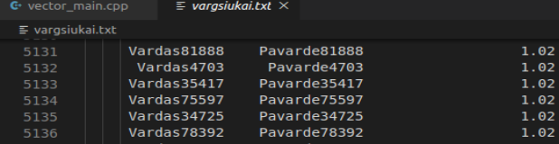

# Vector

1. Panaudojant nuosavą vektoriu reikia įsitikinti kad jis taip pat veikia. Tam atlikti panaudojome: konstruktorių, destruktorių, size(), capacity(), '=' operatorių, '[]' priėjimą prie elementų, push_back() funkcijas. 

  
Rezultatai rodo, kad nuosavo vektoriaus visos funkcijos veikia taip pat ir std::vector.  

2. Atlikta efektyvumos sparta originalaus vektoriaus bei nuosavo vektoriaus lygindami, kiek laiko užtruko tuščius vektorius pripildyt int elementais.(bandymai atlikti pildant 10000, 100000, 1000000, 10000000, 100000000 elementų) 

| Bandymo nr. (elem. sk.)| Nuosavas Vector(laikas sec.)| std::vector(laikas sec.)|
|:----------------------:|:--------------:|:----------:|
| 1. 10000               |0.000531s.      |0.000625s.  |
| 2. 100000              |0.005188s.      |0.005040s.  |
| 3. 1000000             |0.026717s.      |0.035840s.  |
| 4. 10000000            |0.299027s.      |0.275683s.  |
| 5. 100000000           |2.744350s.      |2.612590s.  |

3. Nuosavo vektoriaus funkcionalumas programoje v2.0 yra toks pats kaip ir std::vektoriaus, tačiau nėra realizuotos visos įmanomos funkcijos, kadangi ne visos yra būtinos šioje programoje. Programa veikia teisingai bei visi skaičiavimai atlikti teisingai, o tai parodo rezultatų failai "vargsiukai.txt" bei "kietiakai.txt".
 
 

4. Atlikta spartos analizė programos v2.0 naudodami 100000 įrašų su nuosavu vektoriumi bei su std::vector. Atlikti 3 bandymai
 

| Bandymo nr. (elem. sk.)| Nuosavas Vector(laikas sec.)| std::vector(laikas sec.)|
|:---------------:|:--------------:|:----------:|
| 1.              |0.779687s.      |0.849376s.  |
| 2.              |0.776614s.      |0.865667s.  |
| 3.              |0.797606s.      |0.881262s.  |
|Vid.:            |0.784635s.      |0.865435s.  |

